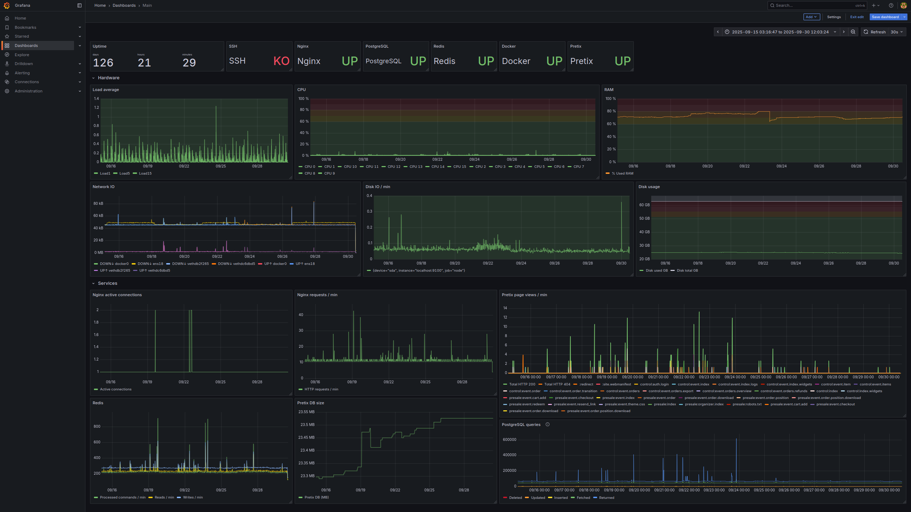

# Pretix Ansible playbook for Bitcoin Lille

This Ansible playbook was developed for the nonprofit Bitcoin Lille, that needed a ticketing system for their first national event in September 2025. While writing such a comprehensive playbook can seem a little over the top, it can significantly reduce disaster recovery times, and facilitate the deployment of future instances.

The playbook installs Pretix in a Docker container (with the Swiss Bitcoin Pay plugin), as well as the necessary dependencies, on a fresh Debian (or Ubuntu) system. It also installs Prometheus and Grafana for monitoring, and automated backup scripts using Duplicity. An Nginx reverse proxy with automatic TLS certificate generation is also included.

## Usage

This playbook was tested on Debian 13.

Once Debian is installed, install `sudo` and add the user to the sudoers without re-asking for a password (NOPASSWD:ALL) (or edit the playbook to suit your needs).

Before running the playbook, update the [`hosts`](hosts) file with the IP address or hostname of your server. Add `ansible_password=yourPassword` in case you're using password authentication.

Take a look at the file [`group_vars/all.yaml`](group_vars/all.yaml) that contains all the variables used in the playbook. For the playbook to run, you need to set at the very least the following variables: `domain_name`, `pretix_domain_name` and `backup_server_address`. 

You probably also want to change the email addresses, passwords and SMTP credentials. You might want to double check the `postgresql_version`. If you are unsure about the purpose of a variable, don't change it.

You can take a look at `playbook.yaml`. While I recommend running everyting, you may want to comment the *Monitoring* play out.

Make sure that there is the appropriate DNS record for the domain name you specified as a variable, and that the machine is reachable on ports 80 and 443.

Once everything is set up, place yourself in the playbook directory and run the magical command: `ansible-playbook -v playbook.yaml`.

## Monitoring

To access Grafana, simply add `/grafana` to your domain name (e.g. `https://pretix.example.com/grafana`). The username is `admin` and the password comes from the variable set previously.

## Backups

A cron job automatically runs a script that will make a full backup every week and an incremental backup every day, using Duplicity. Backups are sent to a remote server through rsync; requirements for the backup server are available in the `Backups` section of `group_vars/all.yaml`.

Instructions for restoring a backup are available in [`roles/pretix_backup/files/Restore_instructions.md`](roles/pretix_backup/files/Restore_instructions.md).

## Versions

This playbook was tested with Debian 13 and Ansible 2.18.8.